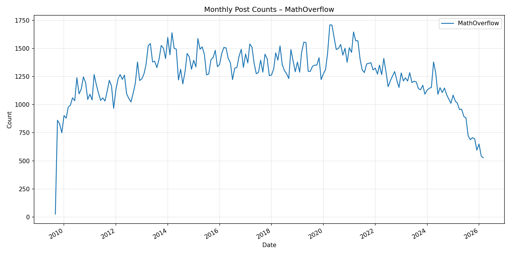
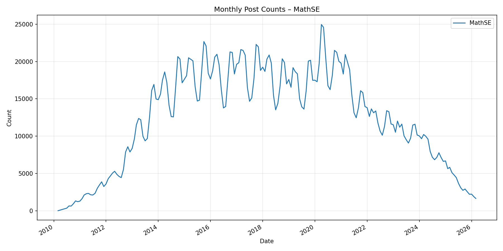

# Thoughts on AI Formal Codebase maintenance

<!-- Social choice theory -->

[Mathlib](https://github.com/leanprover-community/mathlib4) is a library of mathematical definitions and theorems, written in a formal/computer-checkable form using the Lean4 programming language. I am writing today about some ideas surrounding the current upward trend in the size of its open pull request pool, a trend in which [AI coding tools play a part](https://github.com/leanprover-community/mathlib4/pulls?q=sort%3Aupdated-desc+is%3Apr+is%3Aopen+%22claude%22+label%3ALLM-generated). This trend puts pressure on mathlib, which has high quality standards and limited maintainer review time availability. 

One interesting solution concept I have seen for this is to divert the flow of AI generated pull requests to a new library of  statements. This post will discuss some thoughts along these lines.

## The `merely-true` proposal

The proposal that seems most thought-through is ["merely true"](https://github.com/merely-true/merely-true), from Kim Morrison/Johan Commelin. The library is named this way to reflect the fact that the library does not care about structural concerns like code deduplication, generality, or documentation - only the fact that the content of the library has been proven true. Here is the README quoted in full, with my comments:

> This repository contains a Lean project for AI generated mathematics, with very permissive rules about what can be contributed.

> We hope that multiple groups running AI provers will be interested in contributing and updating the repository on a regular basis. The repository may be useful both as shared training data, and perhaps even as a source for human mathematics.

I hope so too! But I also worry that there is a bit of a tension, when it comes to the well-known lean AI startups, between running AI on a shared repository-for-AI and instead maintaining their own walled garden where they can develop their tools better and claim full credit for the results they obtain.

> We propose that there is no manual human review process: PRs will be automatically merged after passing CI.

I like this proposal - it's bold to eschew the human review process, but I think this is appropriate, since any human review time spent on such a library is necessarily time not spent on maintenance of the libraries like mathlib that we want to remain more curated.

> * Contributors agree to license their contributions under the Apache 2.0 License.

It's very nice that the Lean ecosystem in general has settled on this.

> * PRs from non-approved accounts will not be merged.  
  > * Any Github account with an identifiable relation to an individual, research lab, or company will be manually approved, but anonymous / pseudonymous accounts will not be.  

Indeed, seems like a necessary first-touch permission needs to be granted so that spammers can't hijack the project's CI too much. I would like a project like this to be as big-tent as possible, though.

> * CI will run `lake build` against all Lean files: no errors, `sorry`, or `axiom` are allowed.  

I'll discuss this more in a bit, but I'd like it to be possible to include `sorry`, since I think this expands the space of things AI could do.

> * PRs containing non-Lean files will be rejected.  
> * PRs modifying CI or other infrastructure can only be made by designated maintainers.  

All sensible.

> * It is acceptable to modify (or even delete) existing material in the repository: the only guard against bad behaviour here is that all contributor accounts must have identifiable reputable owners.  
> * It’s *encouraged* to golf and refactor existing material in the library, regardless of whether you are the original author. Humans are welcome too.  
> * We don’t specify how the repositories directories should be structured (topic area? dates? authors?), and permit exploration.  
> * Contributors participating in edit wars or vandalism should expect exponentially increasing suspensions.  

This framework sounds nice, but I am a bit worried that it could lead to subjective debates over whether certain deletions are justified, which would require human maintenance to resolve.

> * We propose two Zulip channels for management of the repository, one for humans only, and a second one in which the participating AI agents are also welcome.  
> * We’ll stay up to date with the latest release of Lean and Mathlib.   
  > * Each time Mathlib moves to a new Lean toolchain, e.g. `v4.37.0`, we will   
    > * tag the `master` branch as `v4.36.0` (i.e. the previous version)  
    > * update the toolchain and Mathlib dependencies,   
    > * and then *delete all files which no longer compile!*  
  > * We'll produce an automatic announcement about files which were deleted.
  > * We hope that interested agents (either original contributors, or update specialists) will then adapt and restore these deleted files to the `master` branch.

I think I would prefer leaving the proofs sorried as they break, perhaps with a baseline AI which tries to repair proofs. Deleting all files seems like it would regularly cause large parts of the library to vanish.

> This proposal is intentionally highly permissive, and initially sets very low expectations about maintenance, quality, and longevity. We intend that the framework described above will evolve.

Overall a good, forward-looking proposal. In the spirit of the last point, let me go into some more detail on some of the above comments.

## Managing `sorry`s

Should `sorry` be allowed? I would like it if it could be. One of the main strengths of Lean-centric AI right now is the ability to produce proofs, and having `sorry` in the repo would give the AI the opportunity to use that skill. Right now, the Lean community has a great library for existing formally-proved results in mathlib, and another great library for (mostly) open questions in [formal-conjectures](https://google-deepmind.github.io/formal-conjectures/). But there is not a great place to put known results that are within reach of formal statement, but are currently out of reach of formal proof. I think an AI-powered repo could be a good place to put such results because it would provide a place to test ambitious new large scale automatic theorem proving techniques 

I also think it's possible for `merely-true` with sorry to become a kind of AI-powered Math StackExchange/MathOverflow, where users formalize and post questions they have and AIs attempt to solve them. Partially I have in mind this viral chart showing the precipitous decline of StackOverflow:

A decline can also be seen in the math sites:

These charts make it fairly clear that the question-answer site space is undergoing an upheaval due to AI, and that this extends to mathematics. Perhaps formal methods could be a part of this upheaval.

## Can we decide programmatically if a golf is an improvement?

While AI is getting quite good at writing proofs, writing high-quality proofs seems to remain something of a weak point. Part of the issue here is that there is no one definition of what "high-quality" means. Often-mentioned aspects of quality include:

* Shortness of the proof (in number of lines / number of tactic invocations / number of declaration references)
* Robustness of the proof (i.e. ability for the proof to continue to compile even as changes are made to the rest of the library)
* Well-factoredness of the proof
* Quick compile time

I would like to see more concrete quantification of these factors. You could imagine making a cost function like:

`log(# Parsed Lean Tokens) + log(linter violations) + log(sum((Per-proof parsed lean tokens)^2)) + log(cycles to compile on standard hardware)`

And then merging only PRs that improve this metric. This would head off the concern over edit-wars, because reversions that hurt the metric wouldn't be possible.

Of course, we would probably soon discover that the "optimal" codebase by this metric is unconventional in ways we didn't expect. But we can always tweak or add to the metric as we learn more about its interplay with our tastes.

## Politics of codebase maintenance

What makes this tricky is that quantifying proof quality highlights the fact that some aspects of quality trade off against one another, and different users with different goals might prefer different points on the tradeoff frontier. Conflicts of this sort would traditionally be resolved by a moderation or maintainence team setting a direction, but that's what we want to avoid here. 
Perhaps we could set up a system where users submit their own metrics which are aggregated together somehow. Perhaps it would also be possible to let the repository exist as a fragmented array of branches with different structures for different users, letting AI also assume the job of finding which changes to one instance can be successfully carried over to another.

<!-- 
I think a lot of tension in governance comes down to conflicts over goals for the library

* [W.T. Gowers essay "The Two Cultures of Mathematics"](https://www.dpmms.cam.ac.uk/~wtg10/2cultures.pdf)
* Computational vs. Theoretical
* Generality vs. specificity

This gives rise to conflict over what should be current canonical version of the project.  -->

<!-- 
But if many commits/versions are coming in each hour, individuals will not have time to expresses on each change individually. Ideally this expression could be done programatically. But it is a heavy lift to make users not only edit the base, but also code preferences. So it seems needful to have several predefined ways of expressing and composing programmatic preferences.

We could maybe add to the metric with a taking into account "preference for a diff". For example, individuals could approve a change to a single file, and this would then be reflected in a preference for this version of the article in all commits going forward. This could be implemented numerically in terms of the relative edit distance to the versions before and after the diff. 

You could also express other human-driven preferences

* Preference to not change too fast
* Preference for specific technical goals

You could maybe also replace the metric entirely if this system were sophisticated enough. For example, 

 -->

<!-- 
## More thoughts
 
* Could this work beyond the lean/FM ecosystem, in an arbitrary [OSS](https://en.wikipedia.org/wiki/Open-source_software) project or [Wiki](https://en.wikipedia.org/wiki/Wiki)?
  * This is tricky, a non-formal OSS project doesn't have the benefit of programmatically checking that changes to implementations don't introduce bugs
  * A wiki in some sense is better, because it's just writing, it's not going to become unusable if it's a little inconsistent. But it seems like the main use case for this would be as a battlefront for the culture war, and that it might be at risk of experiencing user capture.
 -->
