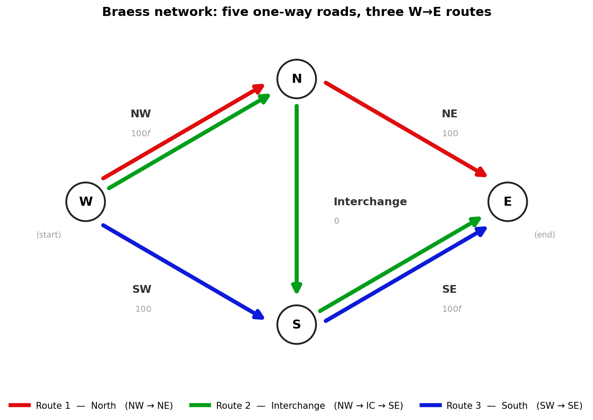
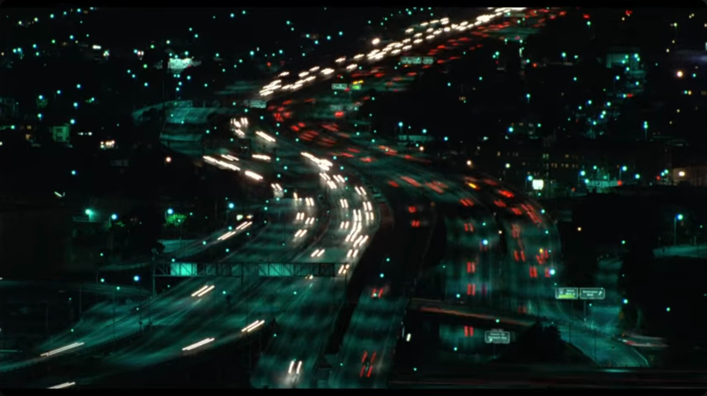
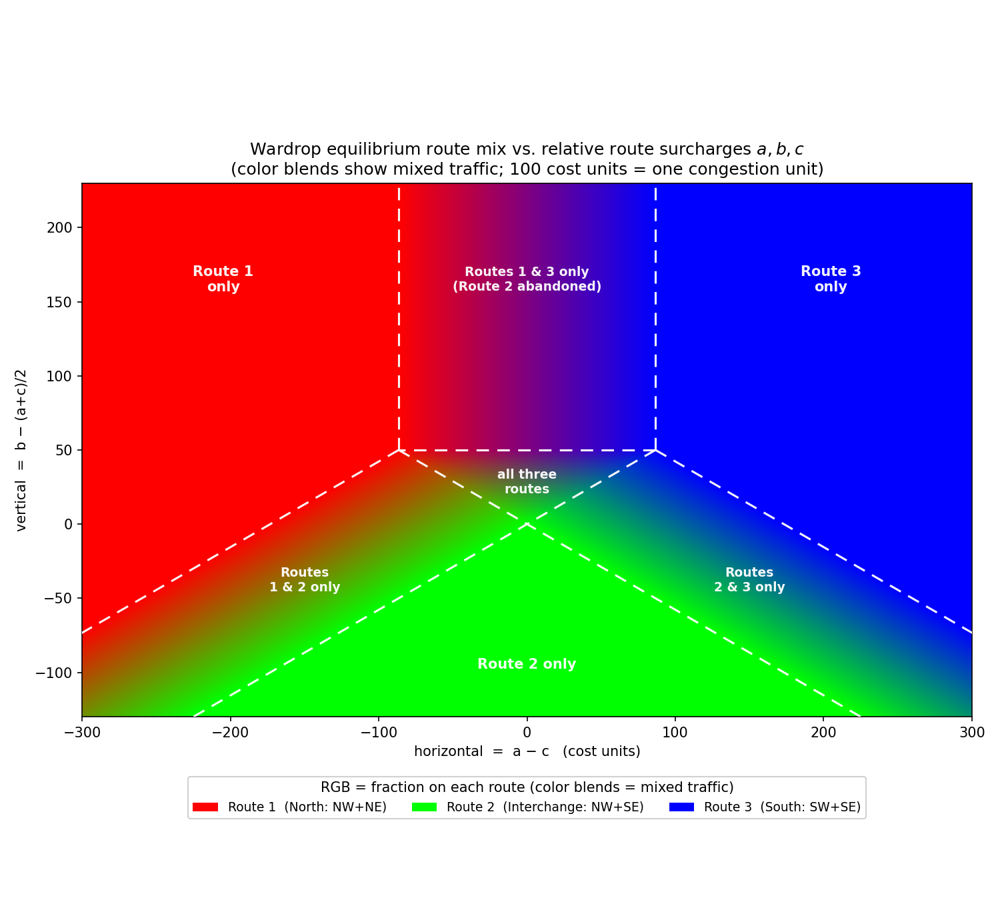

# Philip Glass buys an E-ZPass

[Braess's paradox](https://en.wikipedia.org/wiki/Braess%27s_paradox) is a counterintuitive fact about traffic networks with routes that experience congestion as the number of drivers increases.
Most writing on it^[and its [predecessors](https://oll-resources.s3.us-east-2.amazonaws.com/oll3/store/titles/1410/Pigou_0316_EBk_v6.0.pdf)] carries the tone that it has important implications for governance of these kinds of networks.

For a long time I thought that there was a market-oriented solution involving tolls.
But I recently realized this isn't fully the case, so I am writing this post to explore further.

## Braess's Paradox

Braess's paradox works like this:
We imagine there are a bunch of drivers trying to get from W in the west to E in the east.
There are five roads that they can take to do this:

- A North West road from W to N, which takes time 100⋅f to travel, where f is the fraction of drivers who take this road.
- A North East road from N to E, which takes time 100 to travel no matter how many drivers take the road.
- A South West road from W to S, which takes time 100 to travel no matter how many drivers take the road.
- A South East road from S to E, which takes time 100⋅f to travel, where f is the fraction of drivers who take this road.
- An interchange road, from N to S which takes 0 time to travel.^[I never liked the concept of instantaneous travel, if you like you can add a constant to North West, Interchange, and South East roads without changing the strategic dynamics.]

There are therefore three routes you can take (given the roads are all one-way)

1. North West, then North East
2. North West, then interchange, then South East
3. South West, then South East

We assume road users will always take the route that minimizes travel time, considering the congestion.
The leads to an equilibrium where all drivers take route (2): If any nonzero fraction take route (1), then by switching to route (2) they switch the North East route with cost 100 to the South East route with cost 100⋅f, which is less than 100.
The same logic applies with (3), and the South West and North West routes.
Thus, everyone takes (2) and takes time 200.

The "paradox" is that if the interchange were to be closed (or never built in the first place), then drivers would split evenly among the north and south routes and only take time 150.
Thus, the constructuion of a new road has somehow made things worse for everyone!
Overall, people are spending on average 4/3 longer with the interchange in place.
This number is called the "Price of Anarchy" because it's the difference between what you get in a world where everyone can drive on whatever roads they want and a world where the government steps in and uses taxes or regulation to artificially limit the users on each road to the optimal amount.^[And there is actually a well-known result that 4/3 is the largest it can be for networks with linear congestion functions like this one]

## Adding tolls

A takeaway from Braess's paradox is that, given the costs of constructing roads, and the possibility that they can make things worse for everyone just by existing, we should be skeptical of road construction.

Life out of balance

I always thought this analysis was a bit unfair to road builders.
If only we would set up some kind of turnpike system where the company that builds the road gets to charge a toll for using it, then there are two reasons for the company to prevent the road from being congested by charging a high toll: By preventing congestion they make their product more attractive, and they also simply make more money the more they charge.

I had assumed this free market approach of adding tolls to all the roads would bring their congestion in line with the socially optimal amount.
But doing some modelling, I find it's a bit more complicated.

### My Model

<!-- 
From this, let's take the following five-plus-infinity-player game. Each of the first five players represents a toll company controlling one road. They will choose a toll for their road and be paid off according to how many drivers use their road times the toll they charge. We denominate the toll in minutes, and assume that the rest of the players are drivers who choose a route, and their payoff negative of total toll plus their travel time.

* Can we formalize some version of this game as a usual game in the "Game theory" sense? 
  * Where the concept of "infinite drivers" makes sense, presumably as some kind of limit?

Actually, no this doesn't work, since the toll players always have incentive to deviate, we need to make this be that the driver equilibrium is always attained.
-->

Let's take the following game: Some or all of the five roads may have a toll company controlling them.
These toll companies are the players of this game.
They will each choose a (positive real) toll for their road and be paid off according to how many drivers use their road times the toll they charge.
We denominate the toll in minutes, and assume that the drivers will choose routes according to the equilibrium of driver incentives, given the tolls.

<!-- **Question**s -->

I have a few questions about this game: What are the Nash Equilibria?
Are there multiple?
Are there any?
How does the selection of which roads have toll companies affect this?
What is the analogue of Price of Anarchy (maybe we could call it the "Price of Capitalism)?

The answers to these questions are interesting, but the process of getting them seems to mostly be a matter of rote calculation, so I have used Claude to assist me in preparing them.

### Wardrop Equilibria

I have maybe elided an important question: Is this "equilibrium of driver incentives" well-defined?
Luckily, the answer is yes.
The concept we are discussing is called ["Wardrop equilibrium"](https://www.dii.uchile.cl/~jcorrea/papers/Chapters/CS2010.pdf).
And again, luckily for our purposes it always exists and is unique, whatever the tolls are.^[Wardrop equilibrium always exists and are unique when the congestion cost is strictly increasing
(The proof is not obvious but still relatively simple).
Of course we technically only have that the congestion is increasing on routes rather than all links, but it turns out we have unique equilibria for the Braess network with tolls anyway.]

Let the total toll charge on routes (1), (2), and (3) be a,b, and c respectively.
The folllowing chart shows the driver proportions on each route, as a function of the relative tolls on a and c and the toll b relative to the average of a and c.

Intuitively, there are different regions depending on which roads receive any drivers at all, but within a region, the equilibrium is linear, because it's a result of solving linear equations.

### Equilibrium with interchange toll

Let's start with the simple case with one player controlling a toll on the interchange (after all, this interchange is the "paradoxical" one).

In this case a and c are zero and the toll setter is just setting b.
They have to choose their toll in such a way as to maximize their revenue, taking into account how the drivers will respond.
If they set b to zero, they make no money.
If they set b to 50 or higher, they also make no money because the equilibrium when the toll is this high is to use the other routes.
Because the equlibrium flow goes linearly with the toll, the payoff is quadratic in b and the optimal for the toll setter is to choose b=25.
At this level, half of drivers take the interchange, a quarter take the north route and a quarter take the south route.
The toll setter is making 12.5 minutes per population.
The congested roads both get 75% of the population on them, so all drivers incur 175 minute travel times.
The "Price of Capitalism" (i.e. this cost over the optimal average cost of 150) is 175/150 = 7/6.

### Nash Equilibrium with congestion tolls

What if instead, we looked at the tolls for the North West and South East roads that have congestion on them (after all, it makes sense some social sense to have the congested roads have tolls to limit their congestion, so maybe this could arise from some kind of regulated market situation).
Then the NW and SE playes choose a and c respectively, and b = a+c.

To summarize the Nash Equilibrium analysis, it turns out the only equilibrium is a = c = 100.
This is more than high enough to remove all traffic from the interchange route, basically because at low roll rates, the roads are incentivized to raise tolls purely for revenue reasons, and this tends to push drivers away from the interchange route to avoid being charged twice.

But since no one is going down the interchange route, we have achieved social optimality, and the Price of Capitalism is 1.

### Tollmania

What if all five roads have a toll company?

I was a bit nervous about this one.
It seems like at some point if there are enough toll collectors, tolls will rise so high that you can feel safe making the tolls higher and higher off to infinity.

Apparently this doesn't happen here (though I will admit in this case that I'm too lazy to check all this myself, and I basically am relying on Claude for all the analysis here).
The total usage of the interchange is 25% for a Price of Capitalism 13/12, intermediate between the other options.

## Conclusions

I would summarize these results as follows:

- Adding tolls seems to be generally better for than anarchy
- But tolls also aren't (always) as good as full top-down control
- It seems like where the tolls are placed is important, but counterintuitively it can be better to place them on complimentary roads to the problematic interchange.

Unfortunately, I am not very optimistic that it would be easy to generalize these results into some kind of larger framework, because the more raods we add the more complicated the game theory will inevitably become.
