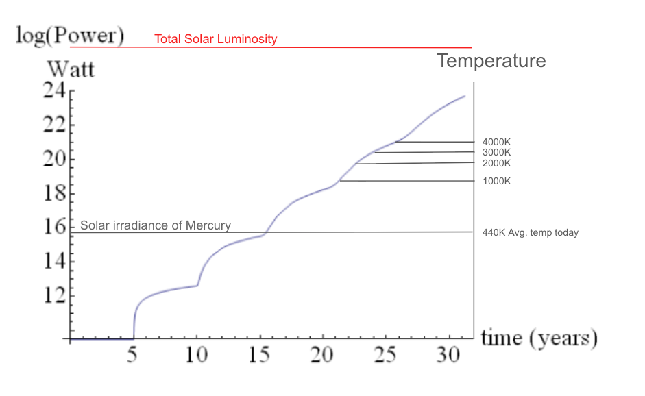

# Disassembling Mercury at High Temperature

[Eternity in six hours: intergalactic spreading of intelligent life and sharpening the Fermi paradox](https://www.aleph.se/papers/Spamming%20the%20universe.pdf) is a 2012 paper that examines what it would take to complete a galactic colonization project. I like the paper because it exemplifies the idea of ["exploratory engineering"](https://en.wikipedia.org/wiki/Exploratory_engineering) - studying forms of engineering that might be physically possible, even if technology hasn't realized them yet.

Exploratory engineering is a fun, but easy to criticize, and that's what I would like to do today!

Section 4 of the paper analyzes how a dissassembly of planet Mercury could be completed by building an ever-expanding fleet of solar energy capturing satellites (["Dyson swarm"](https://en.wikipedia.org/wiki/Dyson_sphere)) out of material launched from Mercury, the energy harvested by which is put back into the process of launching more material.

The paper suggests this could be completed in about 31 years. But towards the end of this process a significant fraction of the sun's energy output would be directed to Mercury. It seems reasonable to think that in practice, the surface of Mercury would become so hot as to disrupt whatever launch equipment we were using.

This post examines this limitation. Also relevant is this [Thread](https://www.lesswrong.com/posts/k774aKEogcCugmKPY/which-parts-of-the-paper-eternity-in-six-hours-are-iffy), in which commenters brought up some of the issues and ideas I'll discuss.

## Basic Radiative Equilibrium Analysis

Suppose all the Sun's power was directed to Mercury and converted to heat. Then if the planet is going to be at equilibrium temperature, the surface of the planet must radiate this energy away. How hot would it have to be to do this?

The total solar power output (["Solar luminosity"](https://en.wikipedia.org/wiki/Solar_luminosity)) is 3.8 × 10²⁶ watts. Mercury's surface area is 7.4 × 10¹³ m² (though perhaps important to note it would shrink during the process).
The [Stefan-Boltzmann law](https://en.wikipedia.org/wiki/Stefan%E2%80%93Boltzmann_law) says that the power radiated by a black body of surface area A and temperature T is:

$$ P = (5.670374419 \times 10^{−8} W \cdot m^{−2}\cdot K^{−4}) A T^4 $$

Solving for the temperature with these quantities, we get: 

$$ T = \sqrt[4]{\frac{3.86 \times 10^{26} W}{(5.670374419 \times 10^{−8} W \cdot m^{−2}\cdot K^{−4}) 7.4 \times 10^{13} m^2}} \approx 98000K $$

So this would be the temperature at full Dyson swarm power. If we only were able to capture a fraction of the power, (or if we were efficient enough in our disassembly that only a fraction of the energy was converted to heat), then this temperature would be lower, proportional to the fourth root of the fraction of power present.

## How hot can we expect launch machinery to function?

The issue that stands out the most to me is that of the machinery that makes up the launch system melting. The highest melting point material seems to be Tantalum Hafnium Carbide at around 4000K. 

[source](https://www.refractorymetal.org/list-of-metals-that-can-withstand-high-temperatures.html)

It seems impossible to me to build a launch system purely out of liquids - the material needs some kind of tube to launch through, and some reason to not break apart as it is accelerated. I don't think refrigerators solve the problem of because refrigerators are machines too and whatever part of the refrigerator is touching the hot side will itself melt.

This is to say nothing about the concern of the ground itself melting or evaporating: The thread notes that the boiling point of most of the materials that make up Mercury (iron, silicates) are at most around 3000K. And the melting points of these materials are around 2000K. 

Running the radiative equilibrium analysis for these temperatures (and 1000K for good measure) and calculating the time needed to consume enough power to liberate Mercury's full binding energy of 1.80 × 10³⁰ J ^[assuming, more generously than the paper, an efficiency of 1/2 so that the same amount of power used in lifting must be radiated as heat.] 

  | Temp  | Power Radiated | Time to Disassemble         |
  | ----- | -------------- | --------------------------- |
  | 1000K | 4.196 × 10¹⁸ W | 4.290 × 10¹¹ sec = 13600 yr |
  | 2000K | 6.714 × 10¹⁹ W | 2.681 × 10¹⁰ sec = 850 yr   |
  | 3000K | 3.399 × 10²⁰ W | 5.296 × 10⁹ sec = 168 yr    |
  | 4000K | 1.074 × 10²¹ W | 1.676 × 10⁹ sec = 53 yr     |

So depending on which of these constraints are actually hard, it would take decades to millennia longer to disassemble Mercury than the 31 years given by the paper.

## Some other potential solutions for deconstructing Mercury

Still, maybe there are ways to get around these engineering problems. Here are some ideas (both from the thread and my own).

### Tungsten Barges

Perhaps we can still get to an operating temperature near the top of the melting points list by just using lots of really high-temperature materials. We can launch from lava-going tungsten barges, or perhaps clad the entire surface of the planet in tungsten to prevent gaseous iron from escaping. We can use concentric arrays of refrigerators with molten iron as the working fluid to keep the core machinery cool.

I am pessimistic though: It seems like at some point in this process you run into increasingly difficult engineering problems that require more and more intermediate machines to solve, decreasing efficiency, etc. More worrying, I think the thing that will get the hottest is infrastructure for actually receiving the energy beam from space - probably it is hard to find materials that remain solid at such high temperature and are simultaneously efficient solar panels.

### Dump heat to planetary core

A suggestion from the thread:

> waste heat can be dumped into Mercury itself.

I am pessimistic about this as a solution.
The minerals that make up Mercury likely have a heat capacity around 500J/kg K. Mass of Mercury is 3.285 × 10²³ kg. So at full solar power input evenly distributed throughout the planet, the temperature would be rising faster than 1K per second, enough to melt the entire planet, inside and out, in a few hours.

I guess it would be ok if the power input were several OOM lower, but there's also the issue of even distribution. Presumably it is hard to drill wells down to the core, so we would at most be dumping heat to the upper layers of the planet. 

How quickly will this heat propagate downwards naturally? Thermal conductance of iron is 80 W/(mK) (lower at high temperatures). At full solar power on the surface OTOO 10¹³ W/m² then for a significant fraction of cooling to come from the core, we would need a temp gradient OTOO 10¹¹ K/m, which we can't have, given the radius of the planet.

<!-- 
Should I look at thermal diffusivity instead?
 -->

### Smash another body like Ceres into Mercury

> [Another interesting proposal: Smash Mercury to bits by colliding other objects like Ceres into it. ](https://www.lesswrong.com/posts/k774aKEogcCugmKPY/which-parts-of-the-paper-eternity-in-six-hours-are-iffy#:~:text=Smash%20Mercury%20to%20bits%20by%20colliding%20other%20objects%20like%20Ceres%20into%20it.%C2%A0)

My first reaction was this was actually actively counterproductive. Even if we could get Ceres into position to smash Mercury, the whole point is that we are trying to *undo* the fact that all this matter is in a gravitational potential well where it is too spherical to collect solar energy. Presumably the smashing will generate loss due to heat, and so more matter would be at the bottom of the well at the end. We would be better off just doing whatever lifting process we can divise and apply it to Ceres itself.

As I think about it more, I see there is a possible benefit. While a substantial fraction of the mass might go down the well, the point is that some mass, perhaps a nonnegligible fraction of the total, will be liberated immediately, much faster than we could otherwise raise it. This has the benefit of fastforwarding us near to the end of the exponential curve, and we can then use a different technique to lift the rest of the mass out of the well, leveraging the mass we have into solar collectors.

But then again, the main concern about the heat seems to be related to the latter part of the disassembly. Another concern that remains is whether it is feasible to move Ceres (or some other large-enough body) from the belt into Mercury-intersecting-orbit. Perhaps it would be better to just collide Ceres and some other belt object (see below)?

### Hot is good, actually

> [Maybe actually a better strategy would be to just deliberately overheat Mercury at that point, turn it into an expanding cloud of superhot gaseous material, and then scoop up said material as it cools down? Not sure if that's possible, maybe the cloud wouldn't expand enough.](https://www.lesswrong.com/posts/k774aKEogcCugmKPY/which-parts-of-the-paper-eternity-in-six-hours-are-iffy#:~:text=just%20deliberately%20overheat%20Mercury%20at%20that%20point%2C%20turn%20it%20into%20an%20expanding%20cloud%20of%20superhot%20gaseous%20material)

In this set up, we don't even need to construct energy beam receivers on the planet, we can just direct light from the sun to Mercury with a mirror.

We calculated before that total solar power into Mercury gives black-body equilibrium of 97000K, plasmizing the planet.

Avg. speed of particles at a given temperature is `sqrt(8 k_B T/ pi m)` which gives:

- 6000 m/s for Fe-56
- 8600 m/s for Si-28

Mercury escape velocity is 4300 m/s, so this might work if we had an already working Dyson sphere. But we are still mostly concerned with the last few orders of magnitude, during which time we might not yet be able to muster this power. This approach seems like an all-or-nothing: Either you have enough power to reach the point where more fermions leave the planets than photons, or you don't.

On the other other hand, it looks like the speed goes with the 8th root of power, so maybe even with 1/256 of solar output we can reach escape velocity. Furthermore, the speeds above are only average speeds. Presumably particles speeds would actually be distributed according to some kind of Maxwell-Boltzmann distribution, and we would only need a small fraction of particles to escape in a given time to get this to work.

<!-- 
- The atoms are hard to get off, but electrons are much lighter, wouldn't they go first?
  - What would happen as the planet itself became positively charged? I think that by the time the colomb force on the is half the magnitude of the gravitational force on protons, it is much more than the gravitational force on electons, because the electrons have less mass.
 -->

Another concern about this approach is the collection strategy. If we just send an iron atom up, it is now in orbit around the sun, and we need to capture it before it gets shot out somewhere else in the solar system or falls back to the planet due to chaos in the orbit. Can we just count on all this iron accreting on our existing satellite swarm?

### Sky scoop

The above suggestion mentioned "scooping". Perhaps we can generalize this idea.

Suppose instead of launching material directly to orbit, we just launch it several hundred meters upward with some kind of trebuchet. We then time this to coincide with a more massive cup-shaped solid metal artificial satellite in a near parabolic orbit passing close to the surface, which is engineered in orbit to collapse around the launched material, catching it. The metal satellite is designed to be large enough that it can completely absorb the impact at orbital speeds, resulting in an inelastic collision that leaves the satellite more massive, but still on a trajectory to clear out to a much higher orbit, where another spacecraft can accelerate it to escape velocity.

ChatGPT Depiction

Some rough equations say that this is about 0.5 energy efficiency, but a nice feature is that the heat seems to be dumped into the satellite, where it can radiate away without affecting operations on Mercury. But a few calculations are open:

- How big the scoops would have to be to not disintegrate on contact?
- How quickly they could be reused?
  - Is the limiting factor refurbiishment of damage to the interior, or just redirecting the momentum of the scoop to flyby again? Can we maybe do gravitational slingshots around other planets as a secondary source of energy?
- How far from Mercury do the cups operate? Do we have to worry about secondary heating?

### Can we spin the planet up with photons?

Riffing on the energy dumping idea, what if we tried to convert the energy into bulk motion rather than heat? That is, we shine photons on one side of the planet to increase its angular momentum.

Taking the total luminosity and dividing by the speed of light, we get a rate of momentum transfer / force of 1.268 × 10¹⁸ N. Mercury's radius is 2.44 × 10⁶ m, so this could be a torque of FR = 3.09 × 10²⁴ N·m. Mercury's moment of inertia is I = (2/5) M R² = 6.5 × 10³⁵ kg m², so we would get an angular acceleration of FR / ((2/5) M R²) = 4.8 × 10⁻¹² s⁻², or an acceleration of a point on the planet equator of FR² / ((2/5) M R²) = (5/2)(F/M) = 1.2 × 10⁻⁵ m/s². Escape velocity on Mercury is 4250 m/s, so we would reach this in 3.5 × 10⁸ s, or 11 years. 
Again it's not that bad if the Dyson sphere is already built, but is not as good if we are actively trying to build the sphere while using this strategy.

Of course, the equator can not get to escape velocity while the planet still holds together. What would happen is that the planet would bulge outward and eventually form into a sort of contact binary and then a binary system of two bodies. I guess this would increase the leverage, but I assume you'd have to put in roughly this OOM of momentum before you could gain this advantage. Maybe another factor of two dpending on if the photons are bouncing off mirrors, but I am ultimately again not optimistic.

### Shaped antimatter blast

Here is another high-energy proposal: Can our mode of lifting, rather than mass drivers, be some kind of shaped charge of antimatter to blast large quantities of rock off the surface all at once?

The thermodynamic benefit of this approach is that even though this mechanism is inefficient and could raise surface temperatures to melting, it doesn't matter because once the blast is over there does not need to be any remaining infrastructure on the planet. Thus, the planet can be allowed to cool off from a very high temperature, spending most of its time above the melting point and therefore radiating energy away more quickly. Once it cools down sufficiently, we can return to the surface and repeat.

### Heat sink

> [attach Mercury to a heat sink many times the size of Jupiter](https://www.lesswrong.com/posts/k774aKEogcCugmKPY/which-parts-of-the-paper-eternity-in-six-hours-are-iffy#:~:text=attach%20Mercury%20to%20a%20heat%20sink%20may%20times%20the%20size%20of%20Jupiter)

This suggestion from the thread might have been a joke, but let's take it seriously. The key problem that would have to be solved is that whatever structure you used to conduct heat away would itself be subject to the gravity of Mercury and would tend to collapse inward.

The "orbital ring" ([video](https://www.youtube.com/watch?v=LMbI6sk-62E)) is an exploratory engineering concept that puts a levitating train on top of and moving counter to an orbiting band of material, effectively letting you have a platform that hovers in midair over a planet. 
You can also make multiple concentric rings to support travel to space from the planet surface without high velocities^[except, of course within the rings themselves].

It's not necessarily clear to me how much energy needs to be spent to maintain the stability of such a system, but perhaps we could use these to support a network of heat exchangers that effectively increase the surface area available to radiate.

## Some potential ideas to build a Dyson sphere without deconstructing Mercury

### Do we need all of Mercury's material to construct the sphere?

The paper seems to work backward from the mass of Mercury and the surface area of a sphere with Mercury's orbital radius to get the density of the orbital reflectors (3.92 kg/m² or 0.5mm thick iron). But if it's reasonable to construct reflectors at this density, could we perhaps make even lighter ones? Gravitational binding energy for a sphere of constant density is U ∝ G ρ² R⁵, so if we get away with using only a fraction α of the mass of the planet, we leave in place a body with radius R·∛(1−α) and binding energy U(1−α)^(5/3), meaning our energy requirement is reduced by a factor of 1 − (1−α)^(5/3) ≈ (5/3)α. 

So if we can make the satellites several OOM lighter, perhaps we can stop the exponential power increase at a level several OOM below full solar power. Can satellite made of a sheet of iron micrometers thick stay rigid? What is the true limiting factor on the density of the collector satellites?

### How far can we get without launching

At Mercury's distance to the sun, the solar irradiance is 9,159 W/m², and at Mercury's cross sectional area that gives 6.5 × 10¹⁵ W. This, then, is the power we'd get from perfectly efficient solar panels just on the surface of Mercury itself. 

I noted this on the chart above I modified from Fig. 2 of the paper - But notice that this figure seems to say that it takes a decade to even get to this power level. It feels like something is being missed here.

### Could we just disassemble other smaller solar system bodies?

> Once Mercury is saturated (can't double any more without overheating it) switch to mining those cold asteroids out in the asteroid belt, with your giant fleet of spaceships you've built with the infrastructure that blankets Mercury and orbits the Sun. The asteroids are all spread out, so it's easier for them to radiate heat.

A [Wikipedia Graphic](https://en.wikipedia.org/wiki/List_of_Solar_System_objects_by_size) claims that all other non planet mass in solar system is about x1000 the mass of Mercury, but that "[The total mass of the asteroid belt is estimated to be 2.39×10²¹ kg](https://en.wikipedia.org/wiki/Asteroid_belt#Composition:~:text=The%20total%20mass%20of%20the%20asteroid%20belt%20is%20estimated%20to%20be%202.39%C3%971021%20kg)", two OOMs less than Mercury.
And of course probably the reason the paper chooses Mercury in the first place is that it's good for solar power to be near the sun, though if you're building out in the belt you can maybe navigate down to the sun with solar sails. 

So my assessment of this idea is that it might be good if we don't need all that much mass. I guess it's also worth wondering about all these heat concerns for the asteroids too.

## Final thoughts

- The graphic at the top of the file lists ℏ, c and G as key limitations in exploratory engineering, but Boltzmann's constant seems relevant too.
- This all seems like good fodder for an incremental game.

<!-- Maybe also quantities like "the maximal tensile strength matter made only from known standard model particles" -->
