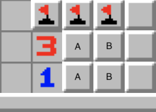
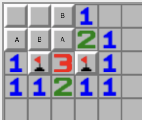
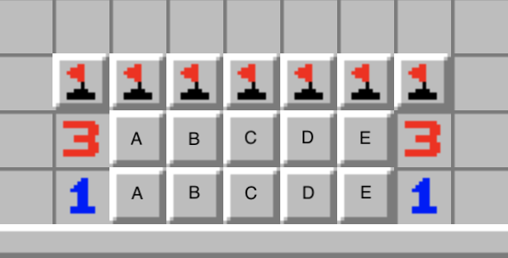

<!-- 
date: 2018-01-01T13:37:00-08:00
draft: false
toc: false
tags:
  - games
  - minesweeper
-->

# Perfect Minesweeper

Related to my previous post on solving chess, this post examines what it would take to make a program to play perfect minesweeper.

## A Deceptively Imperfect Strategy

In the title of [this YouTube video](https://www.youtube.com/watch?v=cGUHehFGqBc), creator [Code Bullet](https://www.youtube.com/@CodeBullet) claims he has made a "perfect" minesweeper bot.
I like Code Bullet's videos, but in this case, the title is a bit dishonest.
A perfect bot would be one that maximizes the probability of winning in any situation, but Code Bullet almost immediately admits he is unsure if his bot really is perfect.

The bot in the video implements a greedy strategy:

1. It flags any square which must be a mine
2. It searches any square which cannot be a mine
3. When there is no square which can be determined with certainty, it guesses a square with minimum probability of being a mine.

As the video explains, one can determine the probability of a given square being a mine relatively quickly in most cases (despite the problem being NP-Hard in general) by enumerating all possible layouts for mines in squares adjacent to clues and then using combinatorics.
A nice implementation which I have been playing around with is [this one](https://mrgris.com/projects/minesweepr/), which also provides a sweet demo (see also [this](https://davidnhill.github.io/JSMinesweeper/index.html?board=30x16x99) one, with a nice autologic feature).

This strategy is a special case of what in minesweeper terminology would be called "nth safety", which in computer science terms would itself be called something like "depth-n expectimax search".

However, nth safety strategies are actually provably suboptimal, as we shall see.

### When Guesses are Optimal: The Forced 50/50

Consider the following layout of mines and solved squares:

Note that in the squares marked A there exists exactly one mine, and there is a 50/50 chance of the mine being in either square.
Note also that *there is no square that can be searched that will reveal more information about which of the A-marked squares contains the mine*.
Even if we determine the contents of all other squares and search the B-marked squares, the only thing the information from the B-marked squares will tell us is what we already know: that exactly one of the A-marked squares is a mine.
So no matter what, the decision of which A-marked square to search first will come down to a 50% risk of hitting a mine.

We can also see that no matter which A square is searched, *it will reveal the same information if it turns out to be safe*, namely

1. We will know the other A-marked square is a mine.
2. We will know the number of mines in the B-marked squares.

For example, if there is one mine in the B marked squares, the top A square is either a mine or a 5, and the bottom A square is either a mine or a 2.

Since the risk is unavoidable, and the information provided is the same, it is therefore optimal to search (exactly) one of these squares before proceeding.
You should always make these guesses first *even if* there are squares that can be solved outright, if for no other reason than not to waste your own time.

In fact, the optimality is sometimes strict.
We can imagine a scenario where there is a cell that is highly safe somewhere on the board, but a forced guess somewhere else.
Greedy strategies will pick the likely safe cell, but this is a mistake, because by picking the forced guess first, you allow yourself the possibility of avoiding any additional guesses at all.
This proves that greedy strategies sometimes choose suboptimal cell openings.

<!-- 
### Other forced 50/50s

Consider this example

There are either mines in both tiles marked A or both marked B.
And depending on the number of mines in the rest of the board there could be mines in one, both, or neither of the free-floating tiles.
But regardless of this, it is optimal to guess either an A or B: Revealing the free floating tiles won't provide any more information about the status of A and B, whereas revealing any A or B not only settles the status or the remaining A and Bs, but it settles the floating tiles as well.
Therefore, better to take the forced 50/50, to learn more about how concentrated mines are in the rest of the grid. -->

<!-- 
## The imperfection of a greedy strategies

The above example suggests that there might be serious problems with the Greedy-Probability strategy.
Now, we'll give an example of a scenario which proves that the Greedy-Probability strategy isn't always optimal.

Now consider the following layout, with 4 mines left:

TODO there should be threes along the top

(this layout of course, has a nonzero probability of occurring in any given game of minesweeper)

By our arguments above, we know it is optimal to guess in the A-marked and E-marked squares.
In fact, this is strictly better than the alternative: If one of the B-, C- or D-marked squares in the middle is chosen, there is always the possibility that there is both a mine in that square, and the one above/below it (it's letter partner).
In this scenario, solving the A- and E-marked first would have alerted us to the location of all remaining mines, immediately winning without incurring any additional risk.

To calculate more precisely, there is a $1/15$ chance that for each of B, C, and D that there are bombs in both those squares.
In that case, conditional on successful A and E guesses, the game is won.
Otherwise, there is one column with no mines, and the other columns have 1 each, and we can see that these columns will be 50% guesses in the conditional on successful A and E guesses.
Thus, the optimal win rate in this position is 10%.

$$
  \frac{1}{4} (1/5 \cdot 1 + 4/5 \cdot 0.25) = 0.1 = 1/10
$$

However, a 1st safety strategy will never choose one of the left or rightmost squares, since the B-, C- and D-marked squares squares each have probability 2/6 = 33% of having a mine, which is less than the 50% of the A- and E-marked squares.
And since the first guess incurs 33% chance of loss, and the A and E guesses are inevitable, the most winrate a 1st safety strategy can have is 1/12 = 8.3%. -->

## Another Helpful Tool for Minesweeper Analysis

The fact that it is usually quick to assign probabilities to all squares means we can formulate a game which is equivalent to minesweeper, but replaces the hidden-information aspect with stochasticity.

A position in "probability minesweeper" (play vibe-coded version [here](./ )) consists of a minesweeper position $\mathcal{P}$ along with a number $x$.
When a play is made on $(\mathcal{P}, x)$ we evaluate the probability $p$ that this move would result in a loss if played on $\mathcal{P}$.
We then reveal a number in the selected cell as if we had conditioned on that cell having no mine, and we decrease $x$ to $p \cdot x$.
When all the empty squares have been revealed, the player's score is taken to be the value of $x$.
One can see by induction that the equity of $(\mathcal{P}, x)$ in smoothed loss minesweeper is just the equity of $\mathcal{P}$ times $x$.

This has the advantage of having less variance in outcome with optimal play, so that the problem of playing minesweeper is reduced to a relatively well-behaved Markov Decision Process, to which we can then approach with various techniques from reinforcement learning.

## A Proposal for Creating a Good, Fast, RL-Based AI

An RL approach that seems to be promising for this task is Deep Q-learning: We create a Convolutional Neural Network which attempts to predict the equity of any move in a given position.
We train this network by having it play minesweeper and adjusting the weights so that the predicted equity of any position is close to the maximum expected predicted equity from any move moves from that position.
We can also modify the algorithm so that whenever there is a move that is provably optimal (either by logically deducing a square has no mine, or from some other logic), we simply make that move rather than query the network about it.

This would seem to be a good approach for the exact reasons it works in AlphaGo.
The network can have convolutional structure to reflect translation invariance of logic and take input in the form of the cell values or the precomputed mine probabilities (note that the value of an opened a cell is always equal to the sum of the adjacent mine probabilities).
It might be wise to have the output be in the form of the logarithm of the equity, so that if the log-probability of a win can be computed for two disjoint sections, those log-probabilities can be added to get the final equity.

## Pruning by move comparison

Suppose that we have created an AI using a combination of Q-learning and hard-coded optimal guesses that is very good at predicting correct moves.
In a certain position, the AI predicts move A is optimal, and we would like to prove quickly that move A is superior to move B.
One way we might be able to do this is by showing that if move A is carried out first and move B is only carried out if move A does not reveal B, then the performance is strictly better.

Explicitly, these are the two strategies we would like to compare

Strategy $\alpha$

1. Play Cell A
2. Reveal any cells that are safe
3. If this process determines that cell B is a mine, then play optimally
4. Otherwise, play Cell B, then play optimally.

And

Strategy $\beta$

1. Play Cell B
2. Thereafter, play optimally

To compare these strategies, we consider 4 possibilities for the contents of these cells, depending on the two events $A$ and $B$ of there being a mine in cell $A$ or $B$

- Event $\bar{A}\bar{B}$: Cell A and Cell B are safe.
  In this case strategy $\alpha$ has weakly better equity since it will reveal both cells and have more information in the A case.
- Event $\bar{A}{B}$: Cell A is safe and Cell B is mined.
  Strategy $\alpha$ will have some equity depending on the probability that cell B is determined after revealing cell A.
  Strategy $\beta$ will have 0 equity
- Event ${A}\bar{B}$: Cell A is mined and Cell B is safe.
  Strategy $\alpha$ will have 0 equity and strategy $\beta$ with have some nonzero equity.
- Event ${A}{B}$: Cell A and Cell B are both Mined.
  Both strategies have 0 equity.

Note that just as we can combinatorially evaluate the probabilities of individual cells being mines (usually quickly in practice) we can combinatorially evaluate the probabilities of each of these outcomes.
We would like to show that the expected value of the equity $V$ of strategy $\alpha$ is greater than that of strategy $\beta$.
This can be expressed by the inequality

$$
  \mathbb{E}[V^\alpha] \ge \mathbb{E}[V^\beta]
$$
or more verbosely
$$
  \mathbb{E}[V^\alpha | \bar{A}\bar{B}]
  \cdot p_{\bar{A}\bar{B}} + \mathbb{E}[V^\alpha | \bar{A}B]
  \cdot p_{\bar{A}B} + \mathbb{E}[V^\alpha | A\bar{B}]
  \cdot p_{A\bar{B}} + \mathbb{E}[V^\alpha | AB]
  \cdot p_{AB} \ge \mathbb{E}[V^\beta | \bar{A}\bar{B}]
                   \cdot p_{\bar{A}\bar{B}} + \mathbb{E}[V^\beta | \bar{A}B]
                   \cdot p_{\bar{A}B} + \mathbb{E}[V^\beta | A\bar{B}]
                   \cdot p_{A\bar{B}} + \mathbb{E}[V^\beta | AB] \cdot p_{AB}
$$

Clearly, we have $\mathbb{E}[V^\alpha | AB] = \mathbb{E}[V^\beta | AB] = 0$.
Furthermore $\mathbb{E}[V^\alpha | A\bar{B}] = 0$ and $\mathbb{E}[V^\beta | \bar{A}B] = 0$.
Thus, the above is equivalent to

$$
  \mathbb{E}[V^\alpha | \bar{A}\bar{B}] \cdot p_{\bar{A}\bar{B}}
  + \mathbb{E}[V^\alpha | \bar{A}B] \cdot p_{\bar{A}B}
  \ge \mathbb{E}[V^\beta | \bar{A}\bar{B}] \cdot p_{\bar{A}\bar{B}}
      + \mathbb{E}[V^\beta | A\bar{B}] \cdot p_{A\bar{B}}
$$

and since in event $\bar{A}\bar{B}$, the player is left with more information if they follow strategy $\alpha$, we have $\mathbb{E}[V^\alpha | \bar{A}\bar{B}] \ge \mathbb{E}[V^\beta | \bar{A}\bar{B}]$ so the above is implied by

$$
  \mathbb{E}[V^\alpha | \bar{A}B]
  \cdot p_{\bar{A}B} \ge \mathbb{E}[V^\beta | A\bar{B}] \cdot p_{A\bar{B}}
$$

We can then attempt to prove this inequality by upper bounding $\mathbb{E}[V^\beta | A\bar{B}]$ and lower bounding $\mathbb{E}[V^\alpha | \bar{A}B]$, using techniques described in the next section.

We could also not loosen and rewrite to

$$
  (\mathbb{E}[V^\alpha | \bar{A}\bar{B}] - \mathbb{E}[V^\beta | \bar{A}\bar{B}])
  \cdot p_{\bar{A}\bar{B}} + \mathbb{E}[V^\alpha | \bar{A}B]
  \cdot p_{\bar{A}B} \ge +\mathbb{E}[V^\beta | A\bar{B}] \cdot p_{A\bar{B}}
$$

Here, we can try to lower bound $\mathbb{E}[V^\alpha | \bar{A}\bar{B}] - \mathbb{E}[V^\beta | \bar{A}\bar{B}]$ by a recursive technique.
If we sample mine positions, we can get a sample of board pairs after following $\alpha$ vs $\beta$, where there is more information in the $\alpha$ board.
We can then again strategy steal $\beta$'s next move after a near-optimal $\alpha$ move.

Hopefully, this will allow a computer to resolve positions which are common in the middlegame: The lowest probability cell is on the edge of the frontier and has a 4-9% chance of being a mine while the vast majority of cells have no clues and are around 20% to have a mine.

## A Proposal for Creating an Actually (Statistically) Perfect AI

We now put together these ideas to describe how to make an AI that plays "statistically" perfectly.

<!-- To be precise about what this means: It wouldn't be a bot that is guaranteed to play perfectly 100% of the time. Instead, it would just be guaranteed, in any position, to play an optimal move 99.999999% of the time, where the probability is taken over the randomness in various statistical tests that the bot runs while doing analysis. This slight relaxation of the goal is important to avoid the need to compute precise evaluations, which seem like they necessarily would make the bot take forever. -->

Using the Q-learning player we can get a statistical lower bound on the equity of any position by doing a rollout where we simulate millions of possible continuations of the game.
The bot then treats the results these statistical tests are the truth, and only moves when it has used these and an other facts to determine an optimal move.
Technically, this means our bot may only play perfectly with some high probability in the sample.
But unlike the previous approaches, this really is only a technicality: we can set the probability of failure to be less than the probability of the computer being struck by a meteorite.

The bot can upper bound the equity of a position by

- doing full depth-bounded expectimax searches
- recursively applying the statistical test logic (with some kind of Bonferroni correction) to determine optimal moves in the position or in children of the position, and then doing full rollouts of the position with the optimal player.
- Some kind of hybrid scheme where it does a rollout but only partially approximates the equity of some tricky positions and then only tightens these results as needed by higher levels of the search.
- Incorporating the method of comparison approach somehow
- The possibilities are endless

<!-- 
Since the [mrgris blog post](https://mrgris.com/projects/minesweepr/) shows that the equity of expert minesweeper is at least ~37.8%, and most cells in a given position have about a 20% chance of being a mine, we can likely prune most branches of the opening position after $\log_{0.8}(0.378) \approx 4.36$ moves.
With a 16 x 30 board, this is $(16 \cdot 30)^{4.36} \approx 4.9 \times 10^{11}$ positions to consider.
Even fewer nodes are needed if the equity is actually larger or with pruning.
 -->

### Potential issues

The nice advantage that the statistical search has that full search is speed: We could plausibly carry out games using the statistical search that a bot which needed 100% perfection would not be able to play out due to spending forever on analysis.

One way that this scheme could fail is the case where two choices are so close in equity that even with an oracle for the perfect move in every subsequent position, it is infeasible to statistically bound the equities tightly enough to differentiate between them.
Perhaps one way this could arise is in the early game, where you often have to play in multiple corners, and it's not obvious whether there's a big difference which one, becuase the position is close to symmetric.
Perhaps another way is if the board gets partitioned into two disjoint minefields.
We might be left with a position where there's a choice in each minefield which is only suboptimal in the extreme situation of one minefield having a disproportionate mine density.

## Speculation and other notes
<!-- 
Interestingly, the game implemented by [this website](http://minesweeperonline.com/) (which I used to create the pictures) has a slight quirk: the first tile chosen always has 0 mines next to it.
Usually, the first square is never a mine, but might not be a 0 square (this is strategically equivalent to a uniform distribution of mines, since there is no point in worrying if the first square can be a mine). -->

One way human players might benefit from a computer solution to the game would be opening theory.
Humans could memorize the optimal moves in the 100-1000 most common positions under optimal play.
Note however, that the move that gives the highest chance of winning might not be best from a speed records perspective.
When trying to set a record, you want to give up early on games that go poorly.
Thus, it might be best to just click a few central locations until you hit a mine or reveal enough squares to make the run worth playing.

Humans playing the game might also benefit from seeing the neural network's response to various positions.
In particular, an understanding of the temperature of a position, in the statistical mechanical sense, might be beneficial.

<!-- ### Percolation

- What is the critical parameter of mine density in a percolation model based on Minesweeper?
  - [Elchanan Mossel has a paper on this](https://www.stat.berkeley.edu/~mossel/publications/mine_sweeper.pdf).
    - But seems very abstract and couldn't find an actual answer.

Seems this could be useful to quickly upper bound equity. -->

<!-- 
### Very General lower/upper bounds on winrate

we can get an upper bound by assuming we are given knowledge of exact mine count of islands of size less than 30, 
and we assume islands of larger size are solved for us, and compute winrate
("island" to mean any configuration of unchecked cells connected by leaps of linfty distance 2 or less)

More concretely, we can assume 

* we are granted knowledge of all 0 cells, 
* we are granted solve of all islands of greater than 30
* we are granted mine counts of remaining islands
* so all that remains is expected numbers and correlations of numbers between smaller cells

Heres another approach: "supercells"

* divide the board into a grid of supercells 
* assume we magicly win instantly if any grid has a number of mines way below the expected number, otherwise allow ourselves to determine mine counts of supercells subjectto these bounds and a sum restriction
  * or maybe some better way of handling non-independence of mine counts in supercells
  * Lovasz local lemma?
* assume for each grid we know all the cells around the boundary and the number of mines inside.
* supercells don't have to be square, or tight upper bounds, we could precompute for important super cells like big rectangles with one or two plays.

How can we quickly get a low bound on winrate from a position?

If we are below the percolation threshold density, we know roughly the distribution of islands we have left to solve once we trigger this. So we can imagine triggering this, then treating the islands as if we had no information from the others to get a lower bound

If not, Perhaps we can do something like, separate the board into the bath, and require to solve the non-bath first, then assume that we can't use that information when solving the bath. This factors the problem.

### Proofs

Can we prove, by induction say, that it is always optimal to play within a L2 distance of 10 to a space played before or an edge, regardless of mine count or existing knowledge?

COuld do some kind of strategy stealing where we prove that playing in the middle of the bulk is not as good as playing at one of the randomly chosen points around that space, and then roughly copying strategy.

### Bernoulli Minesweeper

As the board size goes large, keeping the density the same, the distrubution of mines in any local segment approaches independent Bernoulli samples with that density.

We can therefore consider a "Bernoulli minesweeper" version of the game where this is the mine distribution

This would be simpler to analyze, because we don't have to worry about learnings about the mine density afffecting strategy elsewhere. If I split the board, the two splits are independent.

On the other hand, we can relate it to regular minesweeper

If I am playing Bernoulli minesweeper and all of a sudden I am told the true mine count, then that increases my equity. So the equity of bernoulli minesweeper is no more than the expected equity of the corresponding regular minesweeper.

On the other hand, maybe I can prove Bernoulli / regular minesweeper are monotonic equity in the density for some regimes, so that if I am playing regular minesweeper, and I am given the chance to replace my game with a less dense game approximating a bernoulli, I take it.

-->

### My Predictions for best first move

It would be interesting to know what the optimal opening move in expert minesweeper is.
Writing before making the bot, my priors on this are:

- 75%: Some cell on or adjacent to the edge: Human players seem to think that it's best to start on the corner since you can do more reasoning there.
  - 50% 1-1: You have about a 50% chance of getting a 0 and immediately expanding.
    Otherwise, you have a high probability of a 1, and the 1-3 cell becomes attractive.
  - 20% 2-2 cell: The only way to get a risk less than 20% on the second move if you don't hit a zero is if you reveal a 1 not on an edge or corner, and presumably once you do this, you choose an adjacent cell.
    Playing 2-2 and then 1-1 in response to a 1 is guaranteed to reveal at least seven cells in total.
    I used to think this was the best opener but I may have been biased by the minesweeperonline.com version of the game
  - 5% Some other cell near the corner: Like the 1-2 or 2-3 cell.
    There may be some funky interaction that makes these cells good, sort of like how joseki in go have no clear surface-level explanation.
    Just to put numbers on this, I'll say
    - 3% 1-2 cell
    - 1.5% 3-2 cell
    - 0.5% some other cell near within the 5x5 corner region
- 20% 8-15 cell: Perhaps the human intuition is biased in favor of simpler positions, and the reality is that playing in the middle is correct.
  If the optimal first cell is not on the corner I would expect the answer to be the exact center or the board, since the space of tiles "reachable from the initial reveal without guessing" seems to depend on percolation theory, so it would seem more centralization is better.
- 4% edge cell: Perhaps the best strategy is a compromise between the center and corner.
  This seems unlikely to me though, if the principle of "make early deductions easy" is really correct, wouldn't the corner just be better?
  If this possibility turns out to be correct, I would expect the center of the longer edge to be optimal.
  - 3% 2-15 cell: (since it allows the follow-up 1-15 after 1)
  - 1% 1-15 cell.
- 1% some other cell: It's hard to come up with an explanation of why another cell I haven't mentioned would be optimal.
  In particular, if the center play is correct, I can't see a reason to just play near the center, rather than as close as possible to it.

In general, I assume that the optimal guess in any position is a balance of likelihood of bomb and information gained.
I often make the mistake of making a guess that I could deduce beforehand would give me no information if correct.
I think if you have a guarantee of resolving at least one other square after a guess, that guess is much more attractive.
It's also interesting to ask what to do in the moderately uncommon situation that none of the probabilities of cells next to your previous guesses is less than the ~20% probability we see in the bulk of squares.
Is it right to stay near your previous guesses, or to branch out to the center of the empty space?
I would expect this to be correlated with whether the center is the optimal first move.
