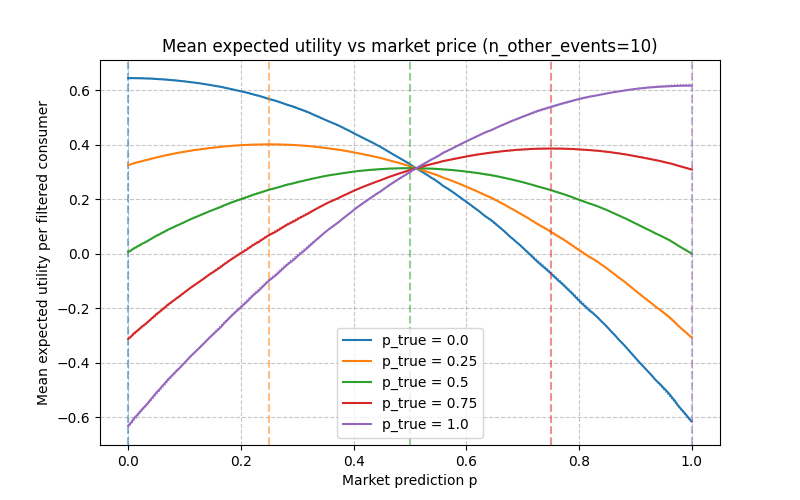
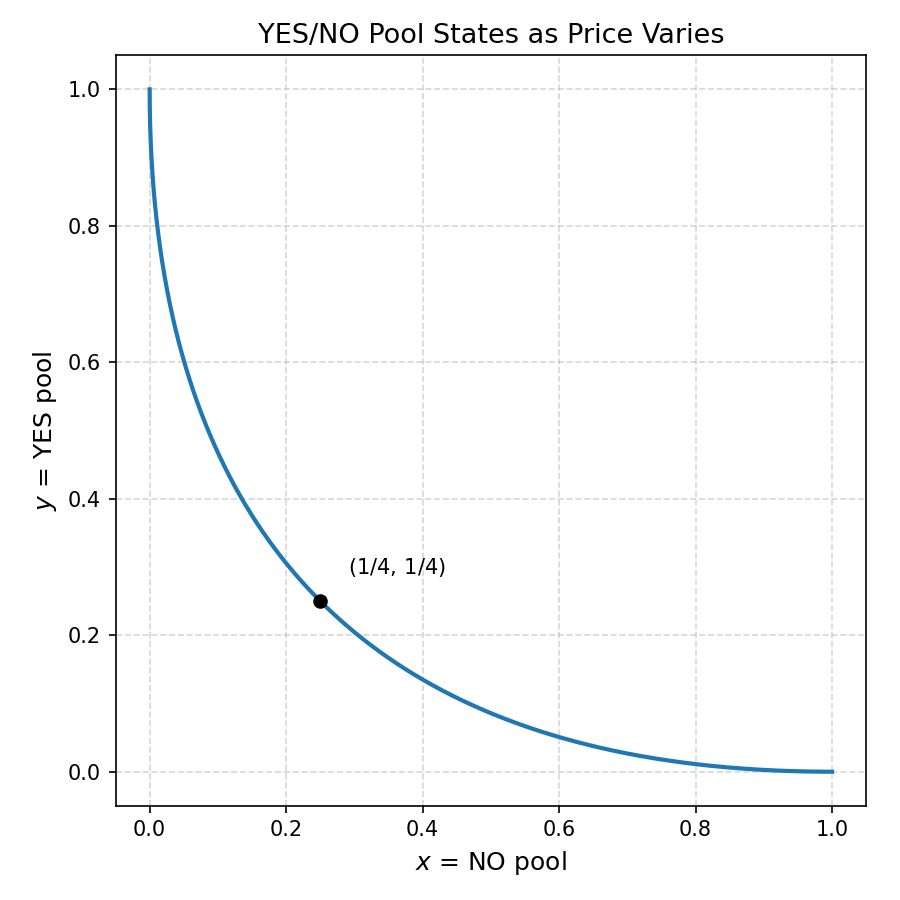

# Which AMMs are best for prediction markets?

<!-- https://discord.com/channels/915138780216823849/927671564177133618/1461846603441766451 -->

This post is a follow-on to my prediction market thoughts series, and to ["Which prediction markets are best?"](https://thequantummilkman.substack.com/p/which-prediction-markets-are-best) in particular. 
In that post I gave some reasons to think that the best choices for liquidity provision depend on what information the liquidity provider wants to get out of the market. 

But that's not very helpful for someone who is making a prediction market platform who doesn't necessarily know anything about what information passive consumers want, and just wants to know how to design their AMM. 
In this post, I will try to give some (hopefully principled) analysis of this question.

## Polycausality induces uniform breakpoint distribution

Let's consider a model where consumers use the information from a prediction market to make a decision:

1. There are a large variety of consumers, with different goals and strategic options.
2. Consumers have some binary decision to make, and will use the information from the prediction market to decide.
3. Consumers will have utilities for each of the four decision-outcome pairs, drawn for each consumer from some joint distribution.
4. Consumers are aware of these utilities and the prediction market price when they decide
5. Consumers will assume the prediction market price is accurate
6. Consumers will decide so as to maximize their utility

The key consideration of the consumer in their choice is their "breakpoint probability" - the point in probability space at which it becomes better to make one decision over another. 
The formula for the breakpoint is given by (for events A and B and options X and Y)

$$ p U(X,A) + (1-p) U(X, B) = p U(Y,A) + (1-p) U(Y, B) $$

$$ p = \frac{U(X,B)-U(Y,B)}{U(X,B)-U(Y,B)-U(X,A)+U(Y,A)} $$

Of course, this value might not fall between 0 and 1 at all. 
In fact, I will argue it is highly likely that $p$ will *not* fall between 0 and 1. 
This corresponds to the possibility that other factors are so much more important than the event itself that the decision is obvious, even without input from the prediction market. 
Essentially, the reason I think this is that the numerator should be much higher variance than the denominator.

This also leads to the following important conclusion: THis asumption *tends to induce a uniform distribution on the location of the breakpoint probability* conditional on the breakpoint probability ending up between 0 and 1 at all - if the distibution has high variance and is smooth, it will look uniform locally.

### Why should we expect that breakpoint probability is not between 0 and 1

Why should we expect this? We can elaborate our model by proposing that the utility for a particular $U(Z, C)$ is made of some components

$$ U(Z, C) = U_{Z,C} + U_Z + U_C + U $$ 

These subscripts are meant to represent dependence on the factors at play:

* $U_{Z,C}$ represents utility that is gained or lost only in the specific outcome *and* choice. For example: I decide to move to a state and a certain president is elected whose polices affect members of that state specifically.
* $U_Z$ represents utility arising only from the choice. For example: I decide to move to a state and I get the benefit or detriment of certain job opportunities, regardless of who is elected.
* $U_C$ represents utility arising only from the outcome. For example: A certain president is elected and their policies affect members of my tax bracket, regardless of where they live
* $U$ represents utility completely independent of my choices or prediction market outcomes. For example: I and my friends and family are in good health.

Our formula for the breakpoint probability becomes

$$ p = \frac{U_{(X,B)}-U_{(Y,B)} + U_X - U_Y }{U_{(X,B)}-U_{(Y,B)}-(U_{(X,A)}-U_{(Y,A)})} $$

My argument here hinges on the thought that $U_X - U_Y$ will tend to be much larger in variance than $U_{(X,A)}-U_{(Y,A)}$ or $U_{(X,B)}-U_{(Y,B)}$. 
One way of seeing this is to realize that there are multiple events that could happen in the world, and there are multiple decisions users could be making in their lives. 
If we modeled the utility for a *collection* of prediction outcomes and decisions, then we might write a $U(Z_1, \dots, Z_n, C_1, \dots C_n)$ as the sum of

$$ U(Z_1, \dots, Z_n, C_1, \dots C_n) = \sum_{i,j} U_{Z_i,C_j} $$

And if we then ignored all but one $i^*, j^*$

$$ U(Z_1, \dots, Z_n, C_1, \dots C_n) = U_{Z_{i^*},C_{j^*}} + \sum_{j \neq j^*} U_{Z_{i^*},C_j}  + \sum_{i \neq i^*} U_{Z_i,C_{j^*}} + \sum_{i \neq i^*,j \neq j^*} U_{Z_i,C_j} $$

If we pay attention, we notice that this has the same form as the above: There are a components that depends on both, each, or neither of the event and the decision. 
So we can fit our new model here in the above model's framework

$$ U_{Z,C} = U_{Z_{i^*},C_{j^*}} $$
$$ U_Z = \sum_{j \neq j^*} U_{Z_{i^*},C_j} $$
$$ U_C = \sum_{i \neq i^*} U_{Z_i,C_{j^*}} $$
$$ U = \sum_{i \neq i^*,j \neq j^*} U_{Z_i,C_j} $$

If we assume all of the $U_{Z_i,C_j}$ were independent and of equal variance, then we clearly see that U_Z (and U_C) are higher variance than $U_{Z,C}$ (and that $U$ is higher variance than either of them, suggesting that none of this really matters at all, so maybe we can forget about this prediction market thing and go touch grass or something). 
This would even probably be true if they were mostly independent and of roughly equal variance.

## The Brier Score as the optimal scoring function

Let's now proceed with the assumption that most users for whom a market matters at all will have a breakpoint probability roughly uniformly distributed between 0 and 1. 
Given this, we can now try to answer the question "how can we maximize the utility of the consumers, as a group?". 
We would like that the money our AMM loses is linearly related to the total utility that the users end up with, so that "the market" as an agent will be incentivized to take on research programs/trading strategies in proportion to how much they would increase user utility. 
So we first have to determine what the expected utility will be for the average user with breakpoint in the range.

<!-- 

Does this depend on the set of researches we think are likely to exist? 
-->

If we (by which I mean I and my coding agent) run a simulation of the above math to see what the utility is for certain market predictions given certain true probabilities we get this plot:

All the utilities turn out to be essentially exactly quadratic, which makes sense, given the uniformity. 

In fact, this chart looks suspiciously similar to one of the options from this GIF on the wikipedia page for scoring rules.

That's right, it's our old friend the [**Brier Score**](https://en.wikipedia.org/wiki/Brier_score)! I guess this line of reasoning really chalks up as a win for that metric.

## Choosing an CFMM that optimizes for Brier score

Continuing on, we want a market maker that lets traders make expected money from their trades in proportion to how much those trades increase the expected Brier score. 
In equations, if the market is at price $p$ and I move it to the true price $p_true$ then I should make expected profit proportional to 

$$ p_{true} ((1-p)^2 - (1-p_{true})^2 ) + (1-p_{true}) ((p)^2 - (p_{true})^2 ) 
= (p - p_{true})^2  $$

One way to conceive of a market maker that achieves this would just be as a uniformly distributed smear of micro-agents over the 0-to-1 probability space, each of whom has an equal amount of shares to sell or buy back at their price. 
(In fact, in a sense, we could see these as related to users from above.) If I buy the price from $p$ up to $p_{true}$, then I am paying $(p+p_{true})/2$ per share on averages for shares that are worth $p_{true}$, for an average profit per share of $(p_true - p)/2$, and with an amount of shares purchased proportional to $(p_true - p)$, the total profit is indeed proprtional to $(p - p_{true})^2$

Can we turn this into a constant function market maker? The answer is yes: There is a(nother) nice [paper of Angeris et al.](https://arxiv.org/pdf/2103.14769) which talks about how CFMMs can be alternately seen in reachable reserve space or liquidity space. 
If we start the market at 50% with equal amounts of liquidity on either side (and do a bunch of renormalization to make sure everything algins with the axes), we ultimately get the following liquidity curve, taking the form of an parabola opening up and to the right. 
(You can also see this "Brier CFMM" mentioned directly in [this](https://arxiv.org/pdf/2302.00196) paper)

Having the constant-function equation for number $N_{YES}, N_{NO}$ of YES and NO shares.

$$ k = \sqrt{N_{yes}} + \sqrt{N_{no}} $$

For 1/4 of a currency unit in liquidity, this gets us a curve that will max out holding one share of either type when it has exhausted its shares of the other type. 
This is in contrast to the CPMM (where the square roots would be replaced by logarithms) which keeps trading forever. 
Perhaps this speaks to how this profile keeps its liquidity focused in the center of the curve.

