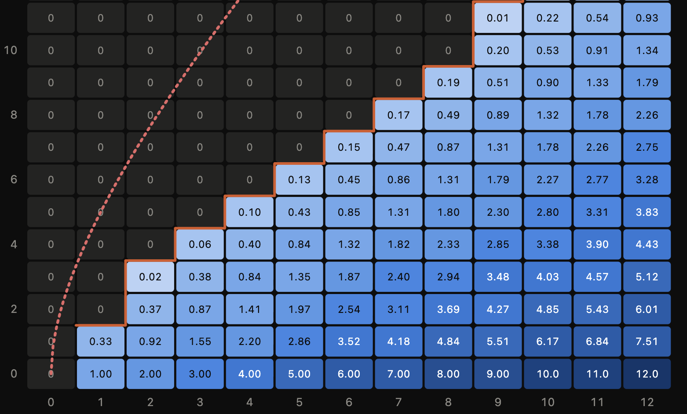

# Problem 14: An explicit bound

Required prerequisite reading for this post is [this other post by blogger Gwern](https://www.gwern.net/Problem-14).

I am particularly interested in this section:

> If you look at the spreadsheet solution, the whole bottom left of the spreadsheet is simple: if you know you should stop when there are x good cards and y bad cards remaining, you don't need to do all the calculations to know you should stop when there x good cards and >y bad cards remaining---it can only be worse, never better.
> This skipping of most of the bottom triangle cuts off almost half the state space (because it's the lower triangle) and thus, skips half the computations, and since we are compute-bound, almost doubles speed:

This is very nice, but I would prefer a proven bound on the number of bad cards where this happens.
This makes it possible, when I am actually playing the game, to avoid recursion altogether and simply return instantly an equity of 0 for some of these values.

<!-- The real content of this file is below, but  -->

To make some **Question**s explicit:

- What upper/lower bounds can we give on the number of red/black cards that will result in a zero/nonzero expected score
  - given a number of black/red cards?
  - given a total # of cards
  - given a fixed difference in the number of cards?
- Can this be turned into a faster algorithm for computing the score/whether the score is positive?
  - In what sense of fast?

## Conjecture

Gwern notes that the score for a balanced deck roughly goes up with the square root of the number of cards.
One can informally justify this observation by observing that an unbiased random walk in one dimension for n steps will have a maximum value around \~√n.
By the same token, one could conjecture that the cutoff for where it becomes suboptimal to continue is when the bad cards outnumber the goodcards by Θ(√n), where n is the number of cards in the deck.
From this, I conjectured that there should be some 0 < k such that when b > r + k√r, it's optimal to stop.

## My proof attempts

I tried for a few years to prove this, but it's tricky.
We would like to have some upper bound on the equity, perhaps proven inductively.
But this upper bound has to have a weird shape: It's zero when b > r + k√r, but when b ≪ r, then it should be around ≈ r − b, because it's likely that around that point we will have drawn the whole deck.

## AI enters the picture

These days I work for [an AI nonprofit](https://projectnumina.ai/), and I have been testing our [Fuse](https://fuse.projectnumina.ai/) application for developing formal proofs.
The conjecture above isn't too hard to formalize, so I stuck it in and asked Fuse to come up with a proof strategy.

After a false start and getting it to come up with some basic definitions, Fuse came up with the approach of interpolating between the zero region and the linear region quadratically and trying to prove that as an upper bound on the equity.
It used the term "supersolution", which I had never heard before, but which seems to just be a fancy term for "upper bound" when you have a differential/difference equation.

## A closer look at the algebra

AI can bash lots of algebra to solve a problem, so it makes sense that the solution it came up with is along these lines.

The proof idea is that, if our supersolution is given as this piecewise formula defined as zero / quadratic / linear for the high / medium / low values of b, then checking that this formula gives an upper bound can be done by proving it remains consistent with the main recursion.
And if we relax the inputs to be nonnegative real numbers, is just a matter of proving some polynomial inequalities hold for each of the cases within and on the border of the regions.

Because the region boundaries are defined using only square roots and arithmetic, the relaxation of this to the reals is a [decidable](https://en.wikipedia.org/wiki/Tarski%E2%80%93Seidenberg_theorem) algebraic problem.
In theory, solving this decision problem might take a long time, but in practice, the AI can verify that the solution is right by programmatically checking a bunch of numbers, and then play with algebraic manipulations for the different regions over multiple turns.

## Positivstellensatz

Fuse was able to handle all of the cases except for the curved border, which it pointed out should be solvable by ["Sum-of-squares" (SOS) / Positivestellensatz techniques](https://www.cl.cam.ac.uk/~jrh13/papers/sos.pdf).
I passed that instruction to an external model with Python support and it was able to find a solution, thereby proving the theorem.

At this point the proof was looking very gnarly, but the appearance of SOS made me optimistic because there actually a [Lean tactic for that](https://github.com/leanprover/sos/).
I was able to use this to golf the proof somewhat (although I couldn't get it to close the main goal, the tactic is unfortunately a bit buggy and/or slow).
After bit more tweaking I got the constant down to c = 4.

## Conclusions

The equity of the Problem 14 game with b black cards and r red cards is at most

- zero for r + 4√r ≤ b
- (r + 4√r − b)² / (6√r) for r ≤ b < r + 4√r
- (r − b) + (8/3)√r for b < r

This seems useful for efficiently computing large values of e(r, b), and certainly for computing which cases you should stop in and which you should continue.
Because you should obviously continue when there are more red cards than black, there are now only 4√r many black-card-counts for which we have to any computation at all (beyond the computation of the square root itself).

Probably it is possible to go further by handing edge cases near zero and using a more powerful sum of squares solver.
I'd be interested in hearing about any progress made on this.

--------------------------------------------------------------------------------

## Record of my work

Timothy Gowers has a [YouTube series](https://www.youtube.com/playlist?list=PLOft35kj95aajgXAFHKklygbpsESMQUid)
where he works problems in real time to give people a sense of the internal process of mathematics.
I really admire this effort, and one of the things I wish he would do more is work on harder problems.
This is a problem I've thought about for several hours now, so I try to document my approach.

## Bounding the critical number of black cards

A few preliminaries: We define e(r, b) to be the equity with r red cards and b black cards.
We can view this as inductively defined as follows:

e(r, 0) = r

e(0, b) = 0

e(r+1, b+1) = max( 0, (r+1)/(r+b+2)·(e(r, b+1) + 1) + (b+1)/(r+b+2)·(e(r+1, b) − 1) )

**Lemma 1** e is monotone increasing in r and monotone decreasing in b.

*Proof* This seemed intuitively obvious to me.
I tried to prove it with induction, but that was too numerical.
Probably the simplest argument is strategy-stealing.
If there are r+1 red cards and b black, I can pretend that a random one of the red cards is marked, generate randomness in my own head to decide which of the red cards I draw this is, and then ignore that red card.
This will lead to me getting exactly the equity of playing with r, b, but with an additional point if I draw the marked card.
Similarly, if I have r, b, but I pretend there are r, b+1 by imagining that there is an invisible black card, (and deciding in my head if I have drawn it before I actually decide to draw).
My score will be the r, b+1 equity, but with 1 more if I draw the invisible black card.

Sorry if that explanation doesn't make any sense (how can it be black if it's invisible?)
it's the shortest I have that convinces me.

**Lemma 2** e(r, b) is no more than 1 different from e(r+1, b) or e(r, b+1).

*Proof* The same proof as before works, but with an invisible red card and a marked black card.

On the basis of these lemmas, we realize that for any r, there is some b\* such that for b ≥ b*, stopping is optimal (e(r, b*) = 0), and for b < b\*, continuing is optimal.

What should we expect r\* to look like in terms of l?
Obviously, b\* ≥ r, since if more than half of the cards are red, even drawing a single card and then stopping is better than just stopping immediately.

Could b\* = r for all r?
After all, with more black cards than red in the deck, it feels like we would be swimming against the stream if we continued.
But actually, there are situations where it is optimal to continue even if we have fewer red cards in the deck.

To see this, consider the extreme: We have a million red cards in the deck and a million and one black cards.
The nice thing about the situation is that in any worst case scenario, we can always just keep drawing cards to the end and get a final score of only -1.
With this in mind, let's try to do better than that.
If we draw a bunch of cards, in the beginning, the plot of our score over time will look roughly like a random walk, due to the fact that there are so many cards in the deck and the proportion is so close to 50/50.
A random walk leads to an approximately normal distribution with standard deviation proportional to the square root of the number of steps.
So if we run 100 or so steps, the distribution on our score will be approximately normal with standard deviation 10 and mean 0 (really -0.0001, but whatever).
With this distribution, there's a great chance our score will be positive.
So we can adopt the strategy of running the game 100 steps and stopping then if our score isn't negative, and if it is, we can always play out the game to -1.

Hopefully this convinces you that it's possible for the optimal move to be to continue for some situations where there are more black cards than red in the deck.
Our reasoning also gives us a hint about how many more black cards we should be willing to tolerate: Since we expect the maximum score with a random walk to be about √r (really, we should use the law of the iterated logarithm, but whatever), I would expect the cutoff to be on the order of √r fewer red cards than black.

Can we prove this?

### A Failed Attempt

Forgetting the above reasoning, let's try to prove an upper bound on b\* by induction.

**Conjecture** There exists an explicit non-decreasing but sublinearly increasing function f to be given later such that for b ≥ r + f(r), it's optimal to stop.
In other words b\*(r) ≤ r + f(r).

*Proof Attempt* By natural induction on r.
The base case b = 0 requires us to set f(0) > 0.

In the inductive case, we adopt the inductive hypothesis that with b = r + f(r), e(r, b) = 0, and we would like to show that b*(r+1) ≤ r + 1 + f(r + 1).
Since f is increasing, it suffices to show b*(r+1) ≤ r+1 + f(r) = b+1.
Suppose for contradiction that e(r+1, b+1) is nonzero.
Since b > r, and we know e(r, b) = 0, It must be optimal to play in the first two moves, otherwise our equity would be negative.
So using the fact that e(r, b) = e(r, b+1) = 0, our equity for (r+1, b+1) is:

e(r+1, b+1) = (r+1)/(r+b+2) + (b+1)/(r+b+2)·( ( (r+1)/(r+b+1) + b/(r+b+1)·(e(r+1, b−1) − 1) ) − 1 )

We can then try to prove that for some choice of f, this will be negative, but this is unproductive.
The issue is that we can't bound e(r+1, b−1) well enough.
Working through the lemma 2 bound, we get a vacuous inequality.
Even if we play out more steps, every black card we draw is a step away from the diagonal frontier of known zero-equity positions so the weakness in lemma 1 increases and that increased weakness cancels out the point loss from the draw.

#### Lessons learned

One thing I noticed here was a slightly more elegant way of phrasing the problem.
We are really trying to prove by induction that e(r+k, b+k) = 0 by making an argument that for small enough r, b, e(r, b) = 0 implies e(r+1, b+1) = 0.
This seems like a better approach, because it describes better our state of knowledge about the equities of nearby positions.

Another thing is that handling all the +1s and +2s in the probabilities was difficult.
Moving forward, I'd rather just upper bound the probability of a black card by p and work with that instead.

### Second Attempt: Upper bounding the Equity

I thought a bit about what could be done in terms of upper bounding the equity on the r = b line and working backwards from there.
One approach could be to try to use the score if the player could see all the cards as an upper bound - this would just be the maximum score over the course of the game.
I don't know yet if this can be evaluated explicitly, perhaps the catalan numbers are involved somehow?
You could also try to compute this or upper bound this in a few ways:

- Sum of the maximum of the current value and zero (seems hard for a closed form for this)
- Find the probability of hitting the max on any given timestep and then condition the value of the max on that
- For every possible maximum value and every number of times that max could be hit, evaluate the probability of that event.

Even if I do get one of these to work, it seems hard to find the frontier from this, since the equity could decrease very slowly.

### Third attempt: Strengthen Lemma 2

One reason the first attempt seemed to fail was that Lemma 2 was not strong enough.
Can it be made stronger?
In particular, can it be made stronger near the zero frontier?

I would expect the answer to be yes.
The whole point of the strategy stealing is that if you have one more red card than the strategy you are stealing, then you only do better than that strategy if you draw the marked card.
But near the frontier, it seems like there would be a high probability that you would hit the frontier and stop early, thus making it unlikely you draw the card.

So I would want to prove a lemma of the following form, for a fixed difference d in the number of red and black cards, and a smaller distance k from the frontier, for sufficiently large R.

**Lemma 3 (general)** Suppose that for all r ≤ R, we have e(r, r+d) = 0, then e(R+d, R+2d+k) − e(R+d, r+2d+k+1) < ε, where ε is an explicit function of R, d, k we give later.

*Proof* Consider the strategy stealing argument for the player with (R+d, R+2d+k+1), copying (R+d, R+2d+k).
The difference in equities is equal to the probability that the stealing player draws the marked black card before stopping.
We can upper bound this by the probability that they stop within t turns, as well as draw the marked black card.
Conditional on stopping within t turns, the probability of drawing the marked card is t/(2R + 3d + k + 1), so all that remains is upper bounding the probability of stopping within this time.

Since we take only t timesteps, the ratio of black to read cards is at least R+2d+k+1 − t to R+d, so the probability of drawing a black card is always at least (R+2d+k+1 − t)/(2R+3d+k+1 − t).

Fuck it this is too much algebra, let's try something simpler, setting k = 1

**Lemma 3 (simpler)** Let d ≥ 2.
Suppose that for all b ≤ B, we have e(b−d, b) = 0, then e(B−d+1, B) − e(B−d, B) = e(B−d+1, B) < ε, where ε is an explicit function of b we give later.

*Proof* Again, the difference in equities is equal to the probability that the stealing player draws the invisible red card before stopping.
Since they are adjacent to the frontier, there is a r/r+b chance they draw red and stop immediately.
Thus ε = r/r+b.

### Revisiting Proof 1 with Lemma 3

Ok now that we have this we can get back to the approach of trying to induct on k in b = r+k.
Assume that e(r, r+k) = 0, and consider e(r+1, r+k+1).
Let p ≈ r/(2r+k) be an upper bound on all probabilities of drawing red that we consider.

Assuming that (r+1, r+k+1) is not 0, then we can bound the equity after one draw.
If the draw is red (with prob p, and call q = 1−p), then we immediately stop and get payout 1.
if the draw is black, we must go again...

- Red -> stop.
  Prob = p.
  Payout = 1
- Black -> Red -> Stop.
  Prob = pq.
  Payout 0
- Black -> Black -> ?.
  Prob = q².
  Payout < −2 + (1 + p) (bounded with lemma 3) = p−1

Thus, the payout is at most p + (p−1)q².
This is positive if p > 0.318.

At least we are now finally getting somewhere: This gives us a nontrivial linear upper bound on f.

We can go a bit further, we know black-> black can't be a stop or else the payout would always be negative.
So we can expand this leaf

- Red -> stop.
  Prob = p.
  Payout = 1
- Black -> Red -> Stop.
  Prob = qp.
  Payout 0
- Black -> Black -> Red -> ?.
  Prob = qqp.
  Payout < −1 + p (bounded with lemma 3) about −0.5
- Black -> Black -> Black -> ?.
  Prob = qqq.
  Payout < −3 + 2 + p (bounded with lemma 3) about −0.5

This gives us the same bound as before.

We could keep pushing the lemma 3 bound finitely, and exhaust a lot of possibilities for strategies, but these bounds will always be linear.
since they always result in some polynomial in p needing to be positive.

### Another attempt idea

It's really annoying, I want a bound that goes like √r.

Maybe I can go back to the max argument with a few more ideas.

- Where on the circle of radius r do we expect to land?
- What is the expected max time between revisiting the line.
- Can we divide and conquer?
- What if put the cards in a circle: In addition to knwing the locations of the cards, the player can "cut the deck" wherever they want.

I like this last idea.
Maybe I can induct on this one.

Or maybe I go back to the maximum prefix idea and ask, what is the probability that adding another black/red card decreases/increases this max?

### Tightening Lemma 3

After going to bed and thinking more about it, I realized the strategy stealing argument can be made tighter by explicitly evaluating the expected time at which we first cross the d frontier.
If we know the equity is zero whenever b − r is greater then its starting value, then the game ends immediately at such a time, and the strategy stealer is less likely to draw the "marked card"

If we start with r red cards and b > r black cards, then the number of ways in which we can have that 2i+1 is the first round in which we have more than b−r more black cards than red cards is given by the number of ways to reach that difference, times the number of ways the game can play out afterwards.
This is

Cᵢ · C(b + r − (2i+1), b − i)

Where Cᵢ = (1/(i+1))·C(2i, i) is the i-th Catalan number.

Now the probability of drawing the "marked card" and thus the probability of the stealing strategy underperforming the stolen strategy, is the expected number of cards drawn over r+b,

Σ (i=1 to r) i · (Cᵢ · C(b + r − (2i+1), b − i)) / C(b+r, r) + (r + b)·Pr(frontier not hit)

(Update from later on.
I read [this](https://drive.google.com/file/d/0B0E4VFlFjnCuQVphRkEwY1JtSlk/edit?resourcekey=0-N6KCKaasze67pGefJXLWrg) and discovered [Bertrand's ballot problem](https://en.wikipedia.org/wiki/Bertrand%27s_ballot_theorem), which gives the probability of not hitting the frontier as exactly (b+r)/(b−r))

I haven't done the math yet, but one could probably just Stirling bound everything, and I'm feeling pretty confident about it.
It feels like for extreme enough n = r+b ≫ b−r, the probably of hitting the frontier early is high, in the sense that it should happen within n^α turns with probability all but 2^(−n^β), for 0 < α, β < 1.

To do the math roughly, if we choose t such that t draws from the deck is not enough to distinguish the deck from coinflips with probability more than p, then the probability that we cross the threshold in t steps is about 1 − 1/t.
The bound we get on the difference is then ≈ (1/t) + t/n · (1−1/t) + p ≈ 1/t + t/n + p.
So if we choose t ≈ √n, we minimize the first two terms.
If we choose t ≈ n/(b−r), then we should expect one more black card than red, so we are doing pretty good in terms of p as well.

## What does all this give us

Putting aside the rigorous proof that f < c√n, let's see what we get if this is true, or even if something like f < c·n^(2/3) is true.

One thing we get is nice average case time for the decision of which is better, to stay or hit.
This would mean that as n → ∞ o(1) fraction of the possible choices for r take more than constant arithmetic operations to decide.

There would still be a strip between b = r and b = r + f(r) where you would have to do dynamic programming to decide.
Could this be helped?
One thing to note is that we could consider lower bounding f as well as upper bounding it to further push the performance.

Here's an interesting idea: Instead of dynamic programming to get exact solutions for equity, you could instead produce upper and lower bounds on equity.

Notice that by repeated application of lemma 2, we could get an upper bound of r − b + f(r) on any position, and a lower bound of r − b (from just playing out to the end).
This gives us the equity of any position to within √r.
We can also lower and upper bound differences of nearby equities using the techniques we have discussed.

We could then run essentially a dynamic programming of the form "For r, b, k please return a bound on e(r, b) to within 2^(−k)".
Since a significant fraction of the equity search space for a single position will be decided as 0, after O(√n) moves, this recursion could compute bounds efficiently.

## See also

See also [this](https://www.gwern.net/Coin-flip).
Can this be improved by similar bounding techniques?
